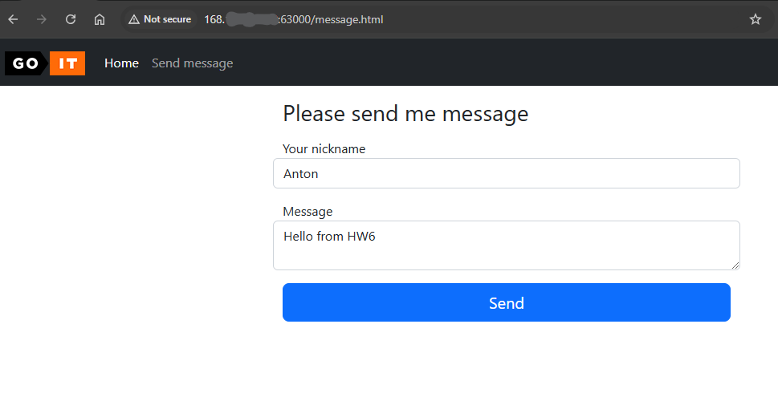
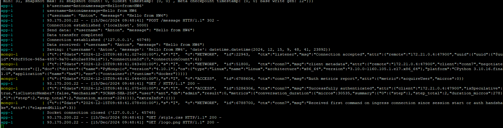
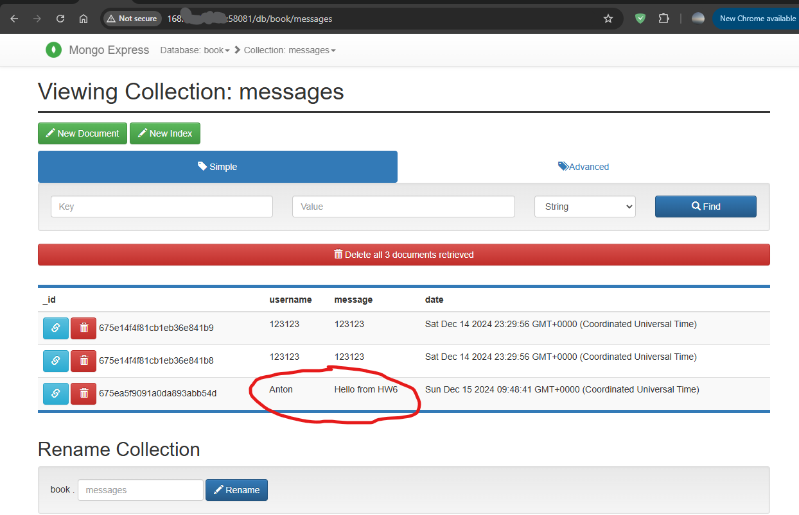

# goit-cs-hw-06
## How to run
* Clone repository
* Copy EXAMPLE.env to .env
* Change mongoDB credentials there (MONGO_USER, MONGO_PW).
* run ```docker compose up```

(data will be persisted in ./db)

## How to connect
Use external port 63000 (or change to another in docker-compose)

(Optional) Uncomment mongo-express service in docker-compose to access mongo web client.

## Test run
Create a message


Form is recieved on web-server, sent to socket-server, datetime is added and persisted in DB


We can check mongo-express to verify that data is added correctly.
